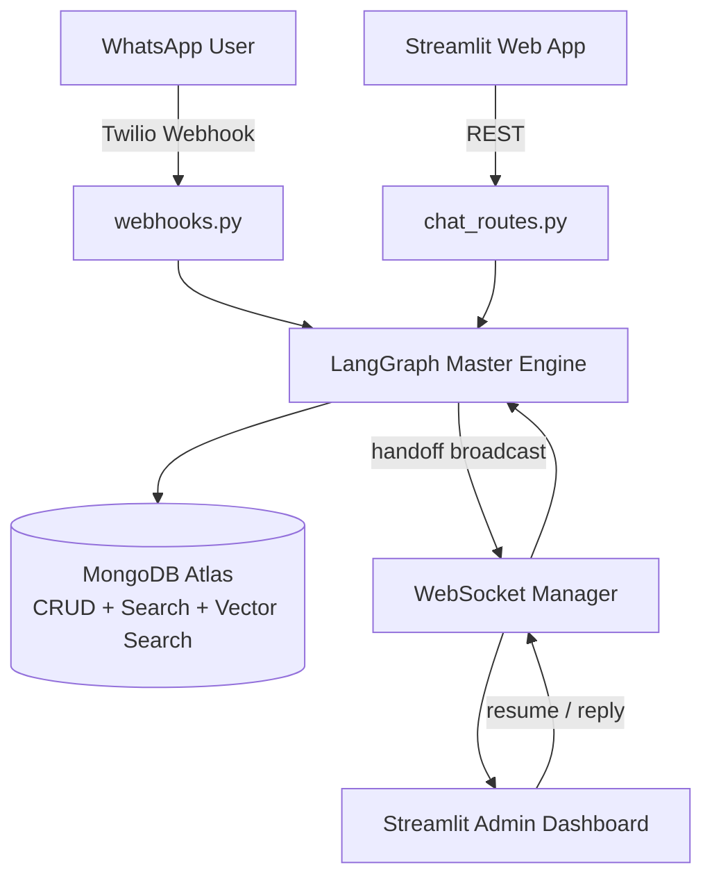
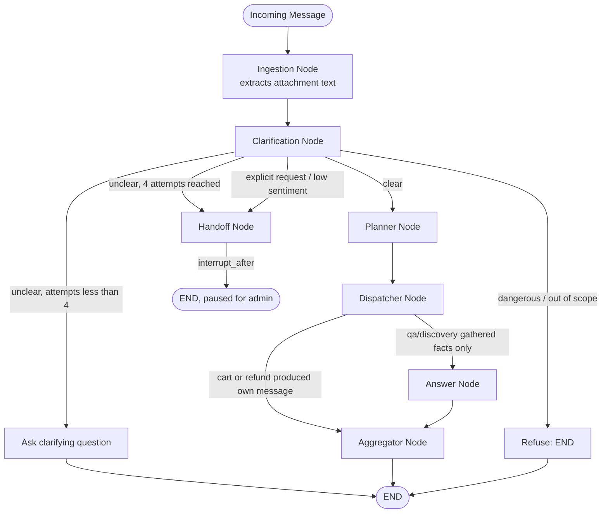
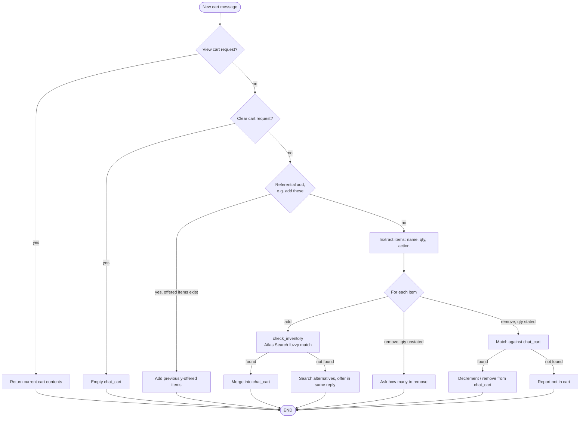
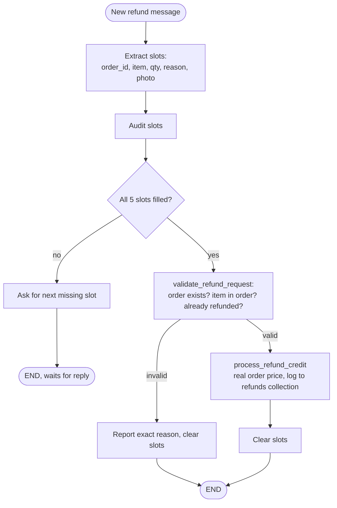
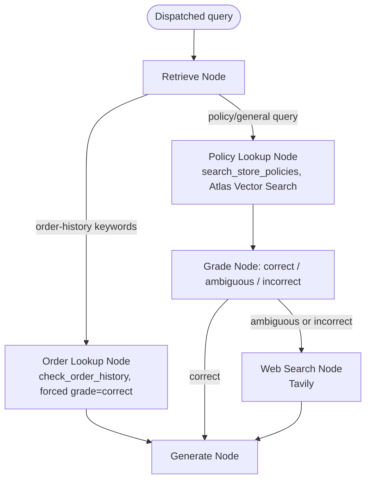
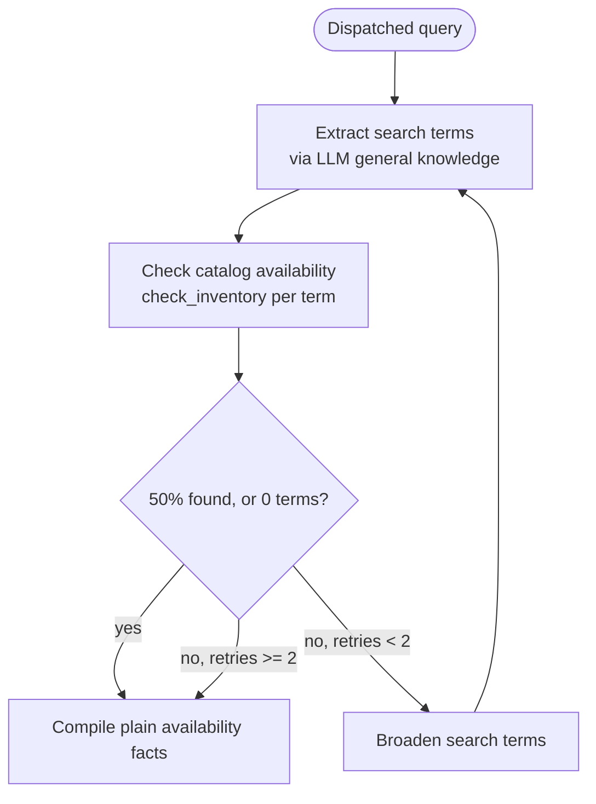
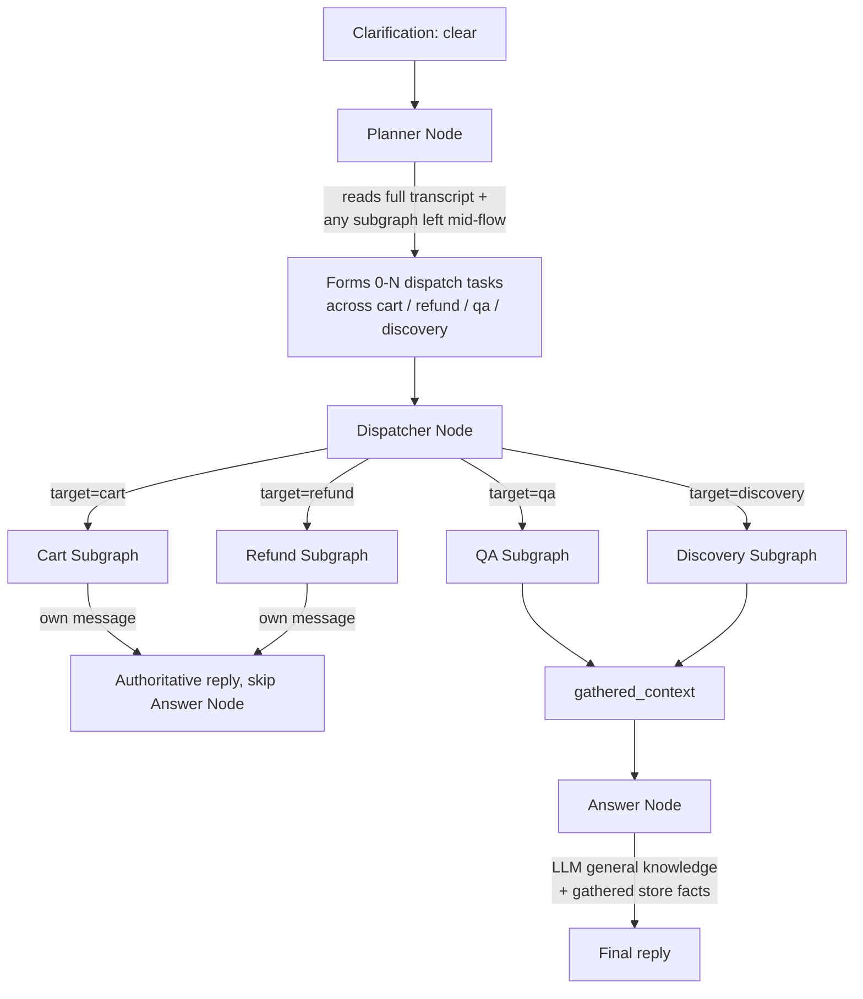

# Quick-Commerce Agentic AI Contact Center

Omnichannel agentic AI for quick-commerce — a LangGraph-orchestrated pipeline (ingestion → clarification → planner → dispatcher → answer) across **WhatsApp** and **web**, with cart management, refund processing (validated against real order data), and Corrective RAG (CRAG) policy/general-knowledge Q&A backed by **MongoDB Atlas Search**.

Built as a full-stack, production-shaped reference implementation: FastAPI backend, Streamlit frontend, real LangGraph state machines with cycles and checkpointing, live WebSocket human handoff, and a CI/CD pipeline deploying to AWS ECS Fargate behind Network Load Balancers.

---

## Table of Contents

- [Features](#features)
- [Tech Stack](#tech-stack)
- [Architecture](#architecture)
- [Master Graph](#master-graph)
- [Cart Subgraph](#cart-subgraph)
- [Refund Subgraph](#refund-subgraph)
- [QA Subgraph — Corrective RAG](#qa-subgraph--corrective-rag)
- [Discovery Subgraph](#discovery-subgraph)
- [Planner → Dispatcher → Answer Flow](#planner--dispatcher--answer-flow)
- [Tools Reference](#tools-reference)
- [Project Structure](#project-structure)
- [Getting Started](#getting-started)
- [Environment Variables](#environment-variables)
- [Deployment](#deployment)
- [Known Limitations](#known-limitations)

---

## Features

- **Omnichannel** — one LangGraph engine serves both WhatsApp (via Twilio) and a Streamlit web storefront, keyed by `thread_id`.
- **Ingestion node** — extracts text from any attached media (image, audio, PDF) before the rest of the graph ever sees the message, so multi-modal input is treated as first-class conversational content.
- **Clarification gate** — judges whether the current message is clear enough to act on, capped at 4 attempts before automatic handoff. Grounds its own clarifying questions in real catalog data (via a live inventory lookup) rather than inventing product names.
- **Planner/dispatcher/answer separation** — a planner reads the full conversation and decides which subgraph(s) — cart, refund, qa, discovery, any combination — are needed for the current turn, and forms a self-contained instruction for each. Transactional subgraphs (cart, refund) write their own authoritative reply; a dedicated answer node only synthesizes replies for pure informational gathering (qa/discovery), and is explicitly barred from ever claiming a transactional outcome it didn't perform.
- **Corrective RAG (CRAG) policy Q&A** — retrieves from the vector index, grades the result (correct / ambiguous / incorrect), and only falls through to a live Tavily web search when local data is insufficient. Order-history lookups are a direct DB fact check and bypass grading entirely — never treated as a knowledge-retrieval problem.
- **Multi-item cart** — add/remove/view/clear via natural phrasing, with real-time fuzzy product search, quantity merging across repeated adds, and an explicit "how many?" clarification when a remove request is ambiguous.
- **Refund flow validated against real orders** — every refund is checked against the user's actual order data before crediting: does the order exist, was the item actually in it, has it already been refunded. Rejects fabricated or mismatched items outright, and writes a real, queryable record to a `refunds` collection.
- **Safety refusal** — dangerous/illegal requests are classified and declined before any other routing logic runs, with no escalation framing.
- **Human-in-the-loop handoff** — sentiment/explicit-request triggered pause via LangGraph's `interrupt_after`, broadcast in real time to a live admin dashboard over WebSockets, with reply relay and resume.
- **Multi-modal on both channels** — real vision description (not just image storage), Whisper transcription, and Docling PDF extraction.

---

## Tech Stack

| Layer | Technology |
|---|---|
| Orchestration | LangGraph (`StateGraph`, cycles, `interrupt_after`, `MongoDBSaver` checkpointer) |
| LLM | Google Gemini (primary) with Groq / OpenAI fallback via `.with_fallbacks()` |
| Backend | FastAPI, Uvicorn (dual-port, single process) |
| Frontend | Streamlit |
| Database | MongoDB Atlas (transactional collections + native `$search` full-text/fuzzy + `$vectorSearch`) |
| Embeddings | `sentence-transformers` (`all-MiniLM-L6-v2`) |
| Web search | Tavily (CRAG fallback for the QA subgraph) |
| Messaging | Twilio WhatsApp API |
| Media | OpenAI Whisper (audio), Cloudinary (images), Docling (PDF) |
| Real-time | Native WebSockets (admin handoff), polling (web chat resume) |
| Infra | Docker, GitHub Actions, AWS ECS Fargate, Network Load Balancers |

---

## Architecture



---

## Master Graph



**Key design decisions:**
- The **clarification node** only judges whether a message is coherent and in-scope — it has no knowledge of any subgraph's internal state. This keeps it bounded in complexity regardless of how many stateful subgraphs exist.
- The **planner** decides subgraph dispatch every turn based on the full conversation plus a fact-based note about any subgraph left mid-flow (e.g. an incomplete refund) — not a separate topic-switch classifier. A stateful subgraph's data simply persists in `AgentState` until it finishes; nothing needs to "protect" it from interruption.
- **Answer node never runs after a transactional message.** If cart or refund produced its own reply this turn, `route_after_dispatch` sends execution straight to the aggregator — this closes a real bug where the answer node once fabricated a "refund completed" message from conversational context alone, with no actual transaction behind it.
- `interrupt_after=["handoff"]` (not `interrupt_before`) ensures the handoff exit message actually sends before the graph pauses, and resuming continues past the node instead of re-triggering it.

---

## Cart Subgraph



Single-node subgraph. Real-time fuzzy product search via MongoDB Atlas `$search` (Lucene-based edit-distance matching, ranks name matches above incidental tag/category matches). Repeated adds of the same product merge into one line rather than duplicating entries. A remove request with no stated quantity asks for clarification instead of guessing — "remove butter" most naturally means "all of it," not "exactly one unit."

---

## Refund Subgraph



Every refund is validated against the user's **actual order data** before anything is credited — not just a duplicate-refund check. `validate_refund_request` confirms the order exists for this user, the claimed item was genuinely part of it, and it hasn't already been refunded, returning the real catalog item name and its real recorded price. This closed a real, serious bug: attached-image vision descriptions were being extracted as refund item names by the slot-extraction step (an unrelated laptop photo produced a refund attempt for "ASUS Expertbook" against a grocery order) — extraction now explicitly excludes image-description text as a data source, and validation is the hard backstop regardless.

---

## QA Subgraph — Corrective RAG



Genuine Corrective RAG, not Self-RAG: retrieval is graded, and the grade determines the correction action — `correct` skips web search entirely (policy questions land here, since the vector index genuinely has that data), `ambiguous`/`incorrect` triggers a live Tavily search. Order-history lookups are structurally routed around the grader altogether — a private order ID is a direct database fact, not something a live web search should ever be asked about. Retrieved JSON is converted to plain, filtered prose (scoped to the specific order or item asked about) before being handed to the generation model — raw multi-order JSON blobs were found to cause the model to misread genuinely present data as "not found."

---

## Discovery Subgraph



Deliberately narrow: discovery only ever answers "is X available, at what price" — it never asserts what a dish needs or judges factual/dietary correctness. That judgment belongs entirely to the answer node's own general knowledge, applied on top of these store-specific facts. This split fixed a real bug where the subgraph's own ingredient guesses (occasionally factually wrong, e.g. suggesting meat for a vegetarian dish) were being presented as fact instead of a plain stock check.

---

## Planner → Dispatcher → Answer Flow



The core pattern: **the planner scopes the turn, gathering subgraphs are pure fact-finders, transactional subgraphs speak for themselves, and the answer node only ever synthesizes non-transactional information.** A single message can dispatch to more than one target — e.g. "what do I need for a sandwich and do you have any of it, add what's available" needs both a discovery/qa check and a cart mutation in the same turn. A deterministic (non-LLM) keyword fallback in the dispatcher also forces a `qa` order-lookup task whenever a refund is mid-flow and the message looks like it's asking about order contents, since the planner's own judgment on this specific pattern proved unreliable even with a strongly-worded prompt.

---

## Tools Reference

| Tool | File | Purpose |
|---|---|---|
| `check_inventory` | `tools/db_tools.py` | Fuzzy MongoDB Atlas `$search` query against `products` (name/tags/category), filtered to in-stock items |
| `validate_refund_request` | `tools/db_tools.py` | Confirms an order exists, the item was actually in it, and it hasn't already been refunded — returns the real matched item name and price |
| `process_refund_credit` | `tools/db_tools.py` | Atomic wallet credit + refund history log |
| `check_order_history` | `tools/db_tools.py` | Schema-aware query against the `orders` collection |
| `search_store_policies` | `tools/vector_tool.py` | MongoDB Atlas `$vectorSearch` against the `policies` collection (`all-MiniLM-L6-v2` embeddings) |
| `web_search` | `tools/tavily_tool.py` | Tavily live web search, used by QA's CRAG correction path |
| `transcribe_audio_bytes` / `transcribe_audio` | `services/media_ingestion.py` | Whisper ASR (bytes-based core + Twilio URL wrapper) |
| `describe_image_bytes` / `describe_image` | `services/media_ingestion.py` | Vision description via Gemini's multimodal input — what makes an attached image actually understood, not just stored |
| `upload_image_bytes_to_cloud` / `upload_image_to_cloud` | `services/media_ingestion.py` | Cloudinary upload |
| `extract_pdf_text` / `extract_pdf_from_twilio` | `services/media_ingestion.py` | Docling layout-aware PDF → text |
| `send_whatsapp_message` | `services/twilio_service.py` | Outbound Twilio WhatsApp send |

---

## Project Structure

```
backend/
├── app/
│   ├── api/            # chat_routes, webhooks, ws_routes, products/profile/checkout routes
│   ├── db/              # mongo_client, seed_db
│   ├── graph/
│   │   ├── nodes/       # ingestion_node, clarification_node, planner_node, dispatcher_node,
│   │   │                #   answer_node, handoff_node, aggregator
│   │   ├── subgraphs/   # cart_graph, refund_graph, qa_graph, discovery_graph
│   │   ├── master_graph.py
│   │   └── state.py
│   ├── services/        # media_ingestion, twilio_service, ws_connection_manager
│   ├── tools/            # db_tools, vector_tool, tavily_tool
│   ├── utils/            # llm_factory
│   ├── config.py
│   ├── main.py           # main API app (port 8000)
│   ├── admin_app.py      # admin WebSocket app (port 8001)
│   └── run.py             # entrypoint: runs both apps in one process via asyncio.gather
└── tests/
frontend/
├── components/           # chat_widget, cart_sidebar, product_card
├── pages/                 # Profile, Cart & Checkout, Admin Dashboard
├── services/               # api_client, ws_client
└── utils/                   # config, state_manager
.github/workflows/ci_cd.yml
Dockerfile.backend
Dockerfile.frontend
backend-task-def.json
frontend-task-def.json
```

---

## Getting Started

### Prerequisites
- Python 3.11
- A MongoDB Atlas cluster with **two** search indexes (see below)
- API keys: Gemini (required), Tavily (required for CRAG's web-search path), Twilio, Cloudinary (optional, for WhatsApp media)

### Setup

```bash
# Backend
pip install -r backend/requirements.txt

# Frontend
pip install -r frontend/requirements.txt
```

Create `backend/.env` (see [Environment Variables](#environment-variables)) and `frontend/.streamlit/secrets.toml`.

### Seed the database

```bash
python -m backend.app.db.seed_db
```

### Create the two Atlas search indexes

**1. Policy vector index** — Atlas → your cluster → Search → Create Search Index → JSON Editor:
- Database/collection: `quick_commerce_db.policies`
- Index name: `policy_vector_index`
```json
{
  "fields": [
    { "type": "vector", "path": "embedding", "numDimensions": 384, "similarity": "cosine" }
  ]
}
```

**2. Product fuzzy-search index** — same process, different collection:
- Database/collection: `quick_commerce_db.products`
- Index name: `products_search`
```json
{
  "mappings": {
    "dynamic": false,
    "fields": {
      "name": { "type": "string" },
      "tags": { "type": "string" },
      "category": { "type": "string" }
    }
  }
}
```

### Run

```bash
# Backend (runs both the main API on 8000 and the admin WebSocket on 8001, one process)
PYTHONPATH=. python -m backend.app.run

# Frontend (separate terminal)
PYTHONPATH=. streamlit run frontend/Home.py
```

---

## Environment Variables

**`backend/.env`**

| Variable | Required | Notes |
|---|---|---|
| `MONGODB_URI` | Yes | Atlas connection string, with credentials |
| `GEMINI_API_KEY` | Yes | Primary LLM |
| `TAVILY_API_KEY` | Recommended | Powers CRAG's web-search correction path; without it, that path degrades gracefully to "web search not configured" |
| `GROQ_API_KEY` / `OPENAI_API_KEY` | No | Fallback chain |
| `TWILIO_ACCOUNT_SID` / `TWILIO_AUTH_TOKEN` / `TWILIO_WHATSAPP_NUMBER` | No | Required only for WhatsApp |
| `CLOUDINARY_*` | No | Required only for image uploads |
| `ADMIN_WS_TOKEN` | Recommended | Shared-secret auth for `/ws/admin` |
| `ADMIN_WS_PORT` | No (defaults to 8001) | The admin WebSocket runs on its own port, in the same process as the main API, so `ConnectionManager`'s in-memory state stays shared for handoff broadcasts |
| `CORS_ORIGINS` | Yes in production | Must be an explicit JSON array of allowed origins (e.g. `["https://your-frontend-url"]`) when `ENVIRONMENT=production` — a validator rejects the wildcard default and the app refuses to start rather than silently run with an insecure CORS policy |

**`frontend/.streamlit/secrets.toml`**

```toml
API_BASE_URL = "http://localhost:8000"
WS_BASE_URL = "ws://localhost:8001"
ADMIN_WS_TOKEN = "same value as backend"
```

---

## Deployment

CI/CD via GitHub Actions (`.github/workflows/ci_cd.yml`): builds and pushes Docker images to ECR (tagged both by commit SHA and `latest`, with GitHub Actions cache to avoid re-downloading heavy dependencies like `torch`/`whisper`/`docling` on every run) → renders both task definitions from GitHub secrets → registers new task definition revisions → forces both ECS services to redeploy.

- **Backend**: ECS Fargate, single task, one process serving two ports directly via `run.py`'s `asyncio.gather` — the main API on **8000** and the admin WebSocket on **8001**. Both are fronted by a single **Network Load Balancer** (`quick-commerce-backend-nlb`) with two separate TCP listeners, one per port, each routed to its own target group.
- **Frontend**: ECS Fargate (Streamlit requires a live server, not static hosting), fronted by its own NLB on port **8501**.
- **No API Gateway.** Originally planned for stage-level rate limiting, but deliberately dropped after evaluating the added setup complexity (HTTP API + VPC Link) against the actual risk profile of this deployment — the frontend now talks to the backend NLB directly. This is a real, considered trade-off, not an oversight: rate limiting can be reintroduced later as a pure infrastructure change (API Gateway in front of the existing NLB) with zero application code changes, if this deployment is ever shared publicly at a scale where that risk matters.
- **No ALB.** A single backend task has nothing to load-balance across, so NLB (Layer 4, cheaper, and a more natural fit for the WebSocket route) is sufficient.
- **No CloudFront.** Evaluated and excluded — the app is session-driven and dynamic (WebSocket reruns, live chat) with little genuinely cacheable content, so a CDN layer would add cost and a cache-invalidation step without a real benefit.

---

## Known Limitations

- Single shared demo account across web and WhatsApp — no per-user authentication, by design.
- Admin WebSocket auth is a single shared token, not per-agent identity.
- Runs a single backend ECS task by design — `ConnectionManager`'s admin WebSocket state is in-memory, so scaling to multiple concurrent backend tasks would need a distributed pub/sub (e.g. Redis) for handoff broadcasts to reach an admin connected to a different task than the one that triggered the alert.
- No API Gateway means no request rate limiting at present — acceptable for the current controlled-access deployment, worth revisiting before any public/unattended sharing of the URL.
- The `refuse` intent is LLM-classified, not backed by a dedicated moderation API — a reasonable mitigation for a demo/portfolio project, not a hard guarantee.
- `check_inventory`'s fuzzy matching is single-collection Atlas Search (typo/edit-distance tolerant), not a semantic vector search the way policy retrieval is — a query like "milk substitute" won't semantically match "almond milk" the way true embedding-based product search would.
- Two admin dashboard metrics (AI Resolution Rate, Avg Sentiment Score) are placeholder values, not computed from real data.
- WhatsApp media ingestion stays inline in `webhooks.py` rather than routed through the shared `ingestion_node` — a deliberate scope decision, since unifying the two would require handling Twilio's URL-based media delivery differently from web's base64-upload shape.
