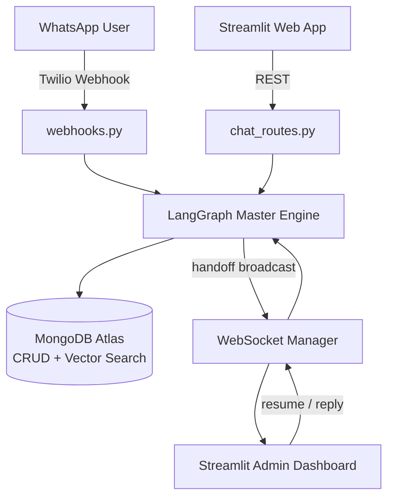
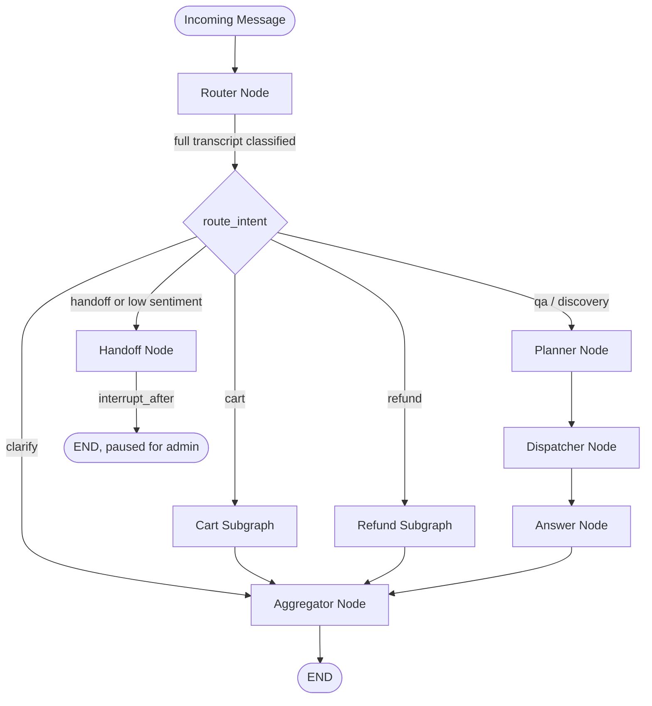
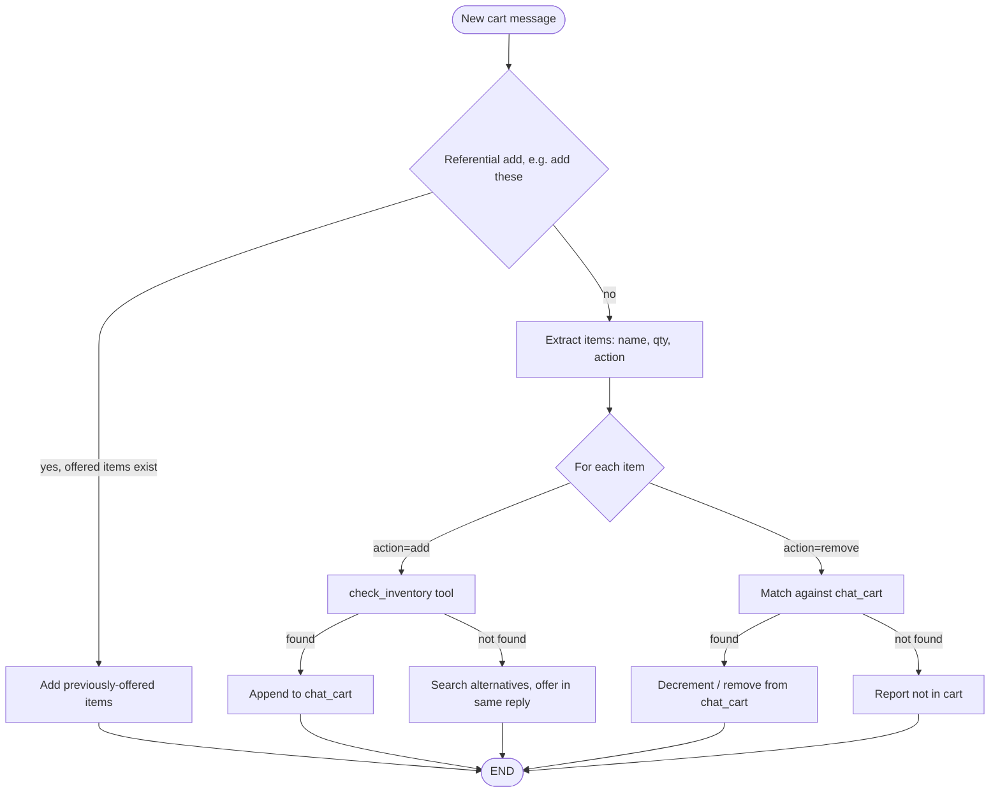
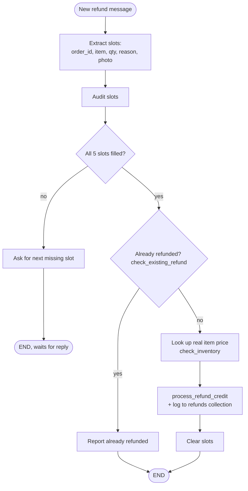
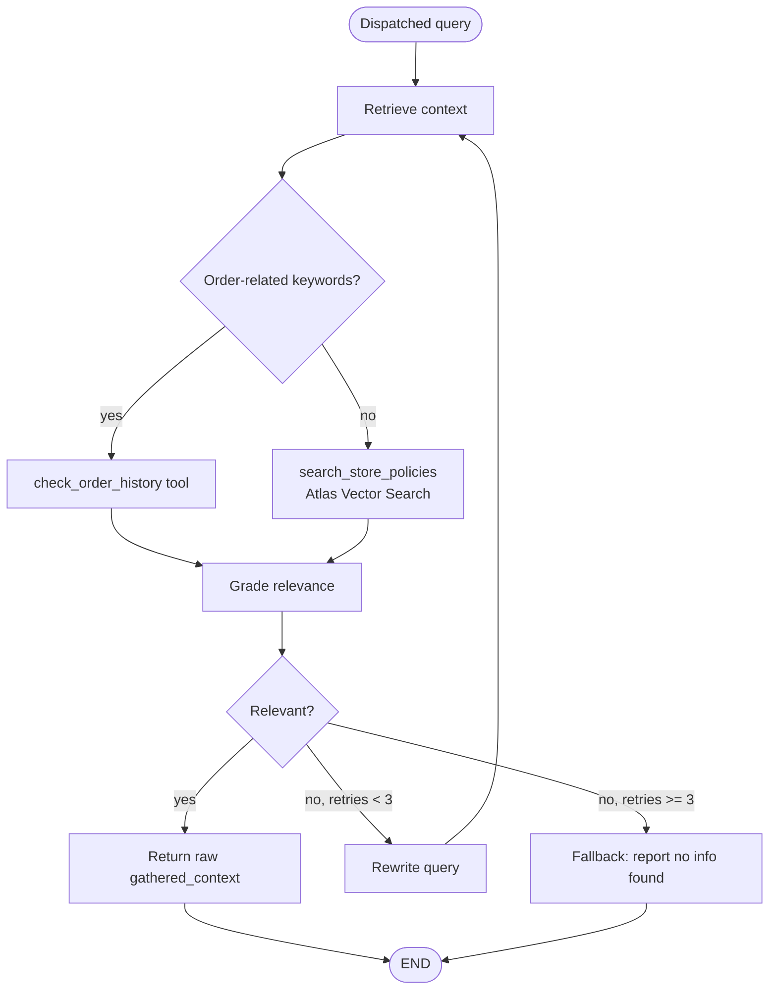
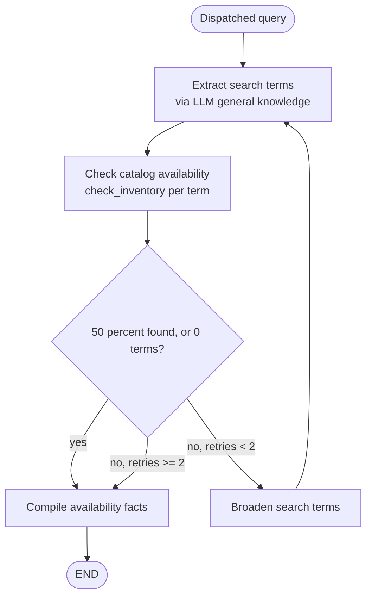
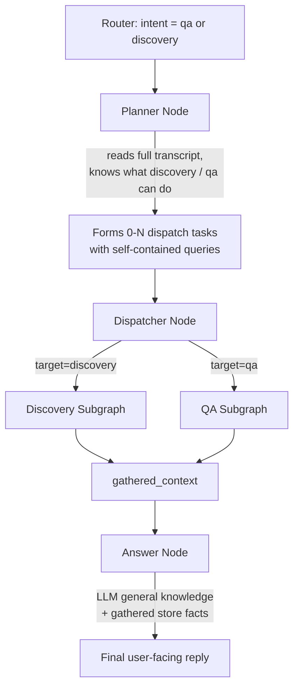

# Quick-Commerce Agentic AI Contact Center

Omnichannel agentic AI for quick-commerce — a LangGraph-orchestrated router, planner/dispatcher, and human handoff system across **WhatsApp** and **web**, with cart management, refund processing, and RAG-grounded Q&A/discovery flows backed by **MongoDB Atlas Vector Search**.

Built as a full-stack, production-shaped reference implementation: FastAPI backend, Streamlit frontend, real LangGraph state machines with cycles and checkpointing, live WebSocket human handoff, and a CI/CD pipeline targeting AWS (ECS + API Gateway + CloudFront).

---

## Table of Contents

- [Features](#features)
- [Tech Stack](#tech-stack)
- [Architecture](#architecture)
- [Master Graph](#master-graph)
- [Cart Subgraph](#cart-subgraph)
- [Refund Subgraph](#refund-subgraph)
- [QA Subgraph (Gathering)](#qa-subgraph-gathering)
- [Discovery Subgraph (Gathering)](#discovery-subgraph-gathering)
- [Planner → Dispatcher → Answer Flow](#planner--dispatcher--answer-flow)
- [Tools Reference](#tools-reference)
- [Project Structure](#project-structure)
- [Getting Started](#getting-started)
- [Environment Variables](#environment-variables)
- [Running Tests](#running-tests)
- [Deployment](#deployment)
- [Known Limitations](#known-limitations)

---

## Features

- **Omnichannel** — same LangGraph engine serves both WhatsApp (via Twilio) and a Streamlit web storefront, keyed by `thread_id`.
- **Dynamic intent routing** — a router node reads the full conversation transcript each turn and classifies intent (`cart`, `refund`, `qa`, `discovery`, `handoff`, `clarify`), asking a clarifying question when it doesn't have enough information rather than guessing.
- **Planner/dispatcher/answer separation** — `qa` and `discovery` intents route through a planner that decides which gathering subgraph(s) to invoke and forms self-contained queries for each; a single answer node then writes the final reply using the model's own general knowledge layered with gathered store-specific facts (stock, price, policy, order history).
- **Multi-item cart management** — add/remove multiple items with quantities in one message, typo-corrected against real catalog vocabulary, with immediate in-stock alternatives offered when an item isn't found.
- **Slot-filling refund flow** — persistent multi-turn refund flow with real item pricing, duplicate-refund protection, and photo/media evidence capture.
- **Self-RAG policy Q&A** — retrieve → grade → retry-with-rewritten-query → fallback loop over a MongoDB Atlas Vector Search index, with LLM fallback chain (Gemini → Groq → OpenAI).
- **Human-in-the-loop handoff** — sentiment/explicit-request triggered pause via LangGraph `interrupt_after`, broadcast to a live admin dashboard over WebSockets, with real-time reply relay and resume.
- **Multi-modal ingestion** — image, audio (Whisper transcription), and PDF (Docling) support on both channels.
- **Full CI/CD** — GitHub Actions pipeline building Docker images, running pytest, and deploying to ECS behind API Gateway (backend) and CloudFront (frontend).

---

## Tech Stack

| Layer | Technology |
|---|---|
| Orchestration | LangGraph (`StateGraph`, cycles, `interrupt_after`, `MongoDBSaver` checkpointer) |
| LLM | Google Gemini (primary) with Groq / OpenAI fallback via `.with_fallbacks()` |
| Backend | FastAPI, Uvicorn |
| Frontend | Streamlit |
| Database | MongoDB Atlas (transactional collections + native `$vectorSearch`) |
| Embeddings | `sentence-transformers` (`all-MiniLM-L6-v2`) |
| Messaging | Twilio WhatsApp API |
| Media | OpenAI Whisper (audio), Cloudinary (images), Docling (PDF) |
| Real-time | Native WebSockets (admin handoff), polling (web chat resume) |
| Infra | Docker, GitHub Actions, AWS ECS Fargate, API Gateway, CloudFront |

---

## Architecture



---

## Master Graph



**Key design decisions:**
- `cart` and `refund` bypass the planner entirely — they're mutation/transaction flows, not gather-then-answer questions.
- `interrupt_after=["handoff"]` (not `interrupt_before`) ensures the handoff exit message actually sends before the graph pauses, and resuming continues past the node instead of re-triggering it.
- The router reads the **full conversation transcript** every turn, not just the latest message — this lets it correctly re-classify mid-flow (e.g. a user asking an unrelated question in the middle of a refund).

---

## Cart Subgraph



Single-node subgraph. Handles multi-item add/remove in one message, typo correction (via `difflib` against real catalog vocabulary), and resolves referential phrasing ("add this", "add all of these") against whatever was last offered by discovery.

---

## Refund Subgraph



Real item pricing (not a flat rate), duplicate-refund protection via a dedicated `refunds` collection, and real photo URLs from the multi-modal ingestion pipeline (falling back to a keyword-detected mock only on the text-only path). Slot persistence across turns relies on the checkpointer, not an internal graph loop — this is what lets a user pivot to an unrelated question mid-refund and return to it later without losing progress.

---

## QA Subgraph (Gathering)



Self-RAG pattern: retrieve, grade, and — critically — **rewrite the query on failure** rather than resending the identical query against the identical index. Returns raw gathered facts only; does not write the user-facing reply itself (that's the shared Answer Node's job).

---

## Discovery Subgraph (Gathering)



Deliberately narrow scope: discovery only ever answers "is X available and at what price" — it never defines what a dish's ingredients are or judges factual correctness. That's handled by the LLM's own general knowledge inside the Answer Node, layered on top of these store-specific facts. This split fixed a real bug where the subgraph's own (sometimes incorrect) ingredient extraction was being presented as fact instead of just an availability check.

---

## Planner → Dispatcher → Answer Flow



This is the core architectural pattern of the system: **the planner scopes the question, gathering subgraphs are pure fact-finders, and exactly one node writes the final answer.** A general-knowledge question ("what are pav bhaji's ingredients") needs zero dispatched tasks; a store-specific question ("do you have amul butter") dispatches to discovery; a mixed question dispatches only the part that genuinely needs real data, and the LLM's own knowledge covers the rest.

---

## Tools Reference

| Tool | File | Purpose |
|---|---|---|
| `check_inventory` | `tools/db_tools.py` | Typo-corrected, in-stock-filtered MongoDB query against the `products` collection |
| `check_existing_refund` | `tools/db_tools.py` | Prevents duplicate refund credit for the same order/item |
| `process_refund_credit` | `tools/db_tools.py` | Atomic wallet credit + refund history log |
| `check_order_history` | `tools/db_tools.py` | Schema-aware query against the `orders` collection |
| `search_store_policies` | `tools/vector_tool.py` | MongoDB Atlas `$vectorSearch` against the `policies` collection (`all-MiniLM-L6-v2` embeddings) |
| `transcribe_audio_bytes` / `transcribe_audio` | `services/media_ingestion.py` | Whisper ASR (bytes-based core + Twilio URL wrapper) |
| `upload_image_bytes_to_cloud` / `upload_image_to_cloud` | `services/media_ingestion.py` | Cloudinary upload |
| `extract_pdf_text` / `extract_pdf_from_twilio` | `services/media_ingestion.py` | Docling layout-aware PDF → text |
| `send_whatsapp_message` | `services/twilio_service.py` | Outbound Twilio WhatsApp send |

---

## Project Structure

```
backend/
├── app/
│   ├── api/            # chat_routes, webhooks, ws_routes, products/profile/checkout routes
│   ├── db/              # mongo_client, seed_db
│   ├── graph/
│   │   ├── nodes/       # router_planner, planner_node, dispatcher_node, answer_node, handoff_node, aggregator
│   │   ├── subgraphs/   # cart_graph, refund_graph, qa_graph, discovery_graph
│   │   ├── master_graph.py
│   │   └── state.py
│   ├── services/        # media_ingestion, twilio_service, ws_connection_manager
│   ├── tools/            # db_tools, vector_tool
│   ├── utils/            # llm_factory
│   └── config.py
└── tests/
frontend/
├── components/           # chat_widget, cart_sidebar, product_card
├── pages/                 # Profile, Cart & Checkout, Admin Dashboard
├── services/               # api_client, ws_client
└── utils/                   # config, state_manager
.github/workflows/ci_cd.yml
Dockerfile.backend
Dockerfile.frontend
```

---

## Getting Started

### Prerequisites
- Python 3.11
- A MongoDB Atlas cluster with a Vector Search index (see below)
- API keys: Gemini (required), Twilio, Cloudinary (optional, for WhatsApp media)

### Setup

```bash
# Backend
pip install -r backend/requirements.txt

# Frontend
pip install -r frontend/requirements.txt
```

Create `backend/.env` (see [Environment Variables](#environment-variables)) and `frontend/.streamlit/secrets.toml`.

### Seed the database

```bash
python -m backend.app.db.seed_db
```

### Create the Vector Search index

In Atlas → your cluster → Search → **Create Search Index** → JSON Editor:
- Database/collection: `quick_commerce_db.policies`
- Index name: `policy_vector_index`
```json
{
  "fields": [
    { "type": "vector", "path": "embedding", "numDimensions": 384, "similarity": "cosine" }
  ]
}
```

### Run

```bash
# Backend
PYTHONPATH=. python -m uvicorn backend.app.main:app --host 0.0.0.0 --port 8000

# Frontend (separate terminal)
PYTHONPATH=. streamlit run frontend/Home.py
```

---

## Environment Variables

**`backend/.env`**

| Variable | Required | Notes |
|---|---|---|
| `MONGODB_URI` | Yes | Atlas connection string, with credentials |
| `GEMINI_API_KEY` | Yes | Primary LLM |
| `GROQ_API_KEY` / `OPENAI_API_KEY` | No | Fallback chain |
| `TWILIO_ACCOUNT_SID` / `TWILIO_AUTH_TOKEN` | No | Required only for WhatsApp |
| `CLOUDINARY_*` | No | Required only for image uploads |
| `ADMIN_WS_TOKEN` | Recommended | Shared-secret auth for `/ws/admin` |

**`frontend/.streamlit/secrets.toml`**

```toml
API_BASE_URL = "http://localhost:8000"
WS_BASE_URL = "ws://localhost:8000"
ADMIN_WS_TOKEN = "same value as backend"
```

---

## Running Tests

```bash
PYTHONPATH=. pytest backend/tests -v
```

Covers: router intent mapping, refund audit/pricing/dedup logic, QA retry-cycle routing, discovery match-threshold logic and context-preservation, planner/dispatcher subgraph selection, and the master graph's `interrupt_after` handoff configuration.

---

## Deployment

CI/CD via GitHub Actions (`.github/workflows/ci_cd.yml`): runs tests → builds and pushes Docker images to ECR → deploys to ECS Fargate.

- **Backend**: ECS Fargate → API Gateway (HTTP API) → VPC Link → NLB → ECS. `/ws/admin` bypasses API Gateway, routed directly through the NLB.
- **Frontend**: ECS Fargate (Streamlit requires a live server, not static hosting) → CloudFront as CDN/TLS layer, with a cache invalidation step on every deploy.

---

## Known Limitations

- Single shared demo account across web and WhatsApp — no per-user authentication.
- Admin WebSocket auth is a single shared token, not per-agent identity.
- Running multiple backend ECS tasks concurrently means an admin connected to one task won't receive broadcasts fired from another (in-memory `ConnectionManager`, not a distributed pub/sub).
- `check_inventory`'s typo correction is vocabulary-based (`difflib`), not a true fuzzy/semantic product search.
- Two dashboard metrics (AI Resolution Rate, Avg Sentiment Score) are placeholder values, not computed from real data.
